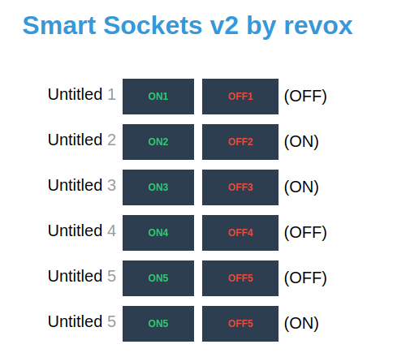

## :house: Simple, ESP-Hosted, web Smart Sockets system

### Demo

### Usage
Download `.ino` and `.h` files from the repository and upload it to your ESP board using Arduino IDE.
After successfull flash webpage to control ESP's pins will be available at ESP's IP address.

### Tweaking
You can edit `mainPage.h` according to your needs. You can add more pins by declaring more load pins and adding more `@@Ln@@`and `t_state` lines.

### Licensing
Code is distributed as public domain. Use it however and wherever you want.
